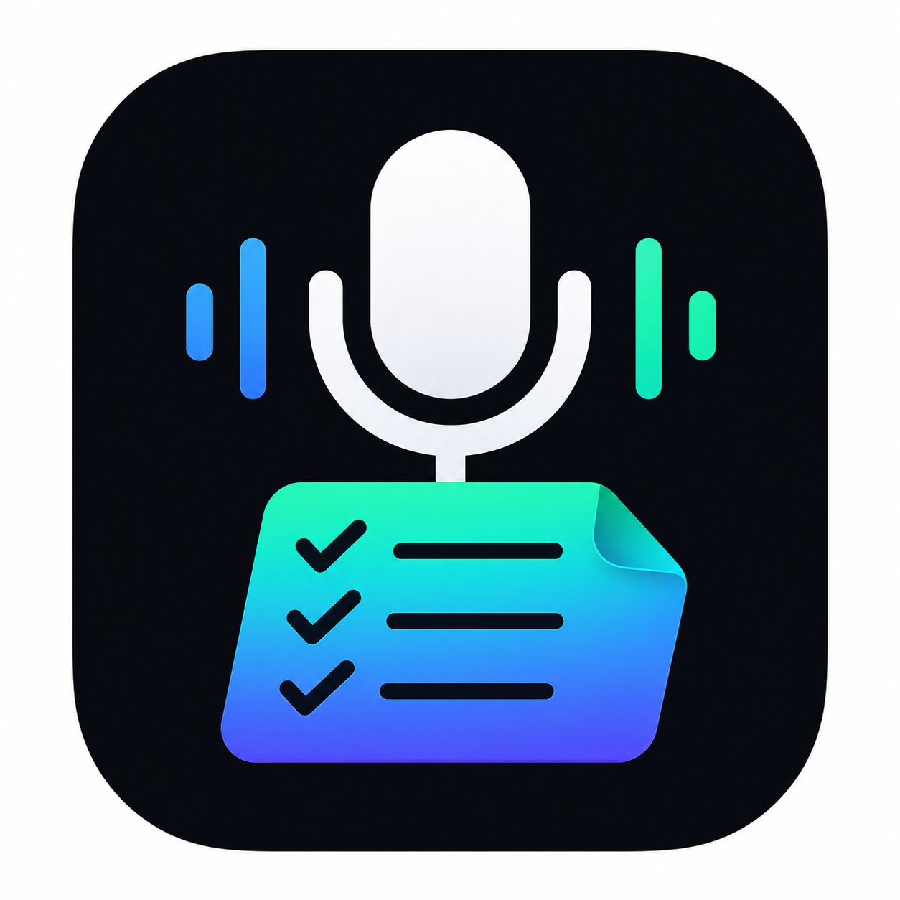
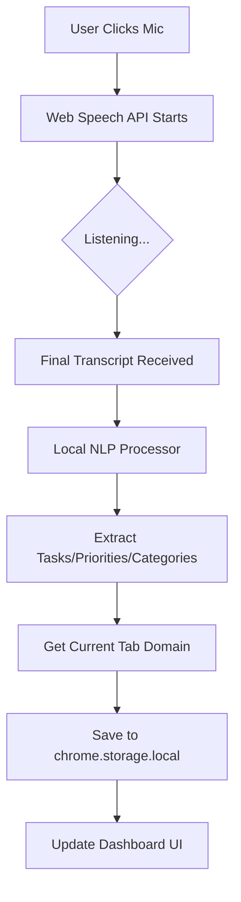
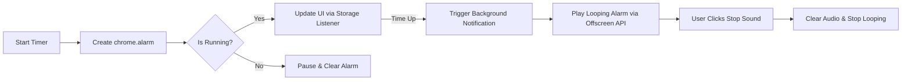

<p align="center">
  
</p>

<h1 align="center">EchoToDo</h1>

<p align="center">
  <strong>Intelligent Voice-Powered Task Management — 100% Local & Privacy-First.</strong><br>
  The modern Chrome Extension that converts natural speech into domain-aware actionable tasks.
</p>

<p align="center">
  
  
  
</p>

---

## 🎙️ Overview

**EchoToDo** is designed for the privacy-conscious power user. It allows you to click a button, speak naturally, and watch as your thoughts are instantly transformed into organized checklists. Unlike other extensions, EchoToDo is **context-aware**—it automatically silos your tasks based on the website you are currently browsing (e.g., GitHub, YouTube, or Jira).

### Key Pillars:
- **Zero API Keys:** No OpenAI, no Gemini, no external cloud processing.
- **Pure Local NLP:** Rule-based parsing happens directly in your browser.
- **Domain Silos:** Never mix your "Work" Jira tasks with your "Personal" YouTube notes again.
- **Deep Focus:** Integrated high-precision Pomodoro timer with audible alarms.

---

## ✨ Features

### 1. Voice-to-Task System
Convert natural speech like *"Finish the login page and email the client by tomorrow !high #work"* into:
- ✅ Finish the login page
- ✅ Email the client by tomorrow
- *Automatically detects priorities (!high) and categories (#work).*

### 2. Context-Aware Storage
Your task list adapts to your workflow.
- **github.com:** Shows code reviews and PR tasks.
- **youtube.com:** Shows video ideas and watch later notes.
- **general:** A fallback space for everything else.

### 3. Pro Productivity Timer
A detailed `HH:MM:SS` timer for deep work.
- **Custom Durations:** Set precise focus and break intervals.
- **Looping Alarms:** Loud alerts that won't stop until you acknowledge them.
- **Background Persistence:** Works even if you close the extension popup.

### 4. Modern Glassmorphism UI
A premium, dark-mode aesthetic with smooth animations, progress rings, and intuitive navigation.

---

## 🛠️ Technical Architecture

### Core Logic Flow (Voice to Task)


### Productivity Timer Flow


---

## 🚀 Installation

1. Clone this repository:
   ```bash
   git clone https://github.com/Sujoymoulick/EchoToDo.git
   ```
2. Open Chrome and go to `chrome://extensions/`.
3. Enable **Developer Mode** (toggle in the top right).
4. Click **Load unpacked** and select the `EchoToDo/` folder.
5. Follow the **Onboarding Flow** to grant microphone permissions.

---

## 🔒 Privacy
EchoToDo is built with a "Privacy-First" philosophy. 
- **No Tracking:** We don't use cookies or analytics.
- **Local Storage:** Your tasks live only on your computer.
- **Local Processing:** Speech-to-text happens via the browser's native API; no data is sent to external AI servers.

---

## ☕ Support the Developer

If you find EchoToDo helpful and it helps you stay focused, feel free to support the project!

<p align="center">
  <a href="https://paypal.me/SujoyMoulick?locale.x=en_GB&country.x=IN">
    
  </a>
</p>

---

<p align="center">
  Built with ❤️ for privacy and productivity. © 2026 EchoToDo.
</p>
